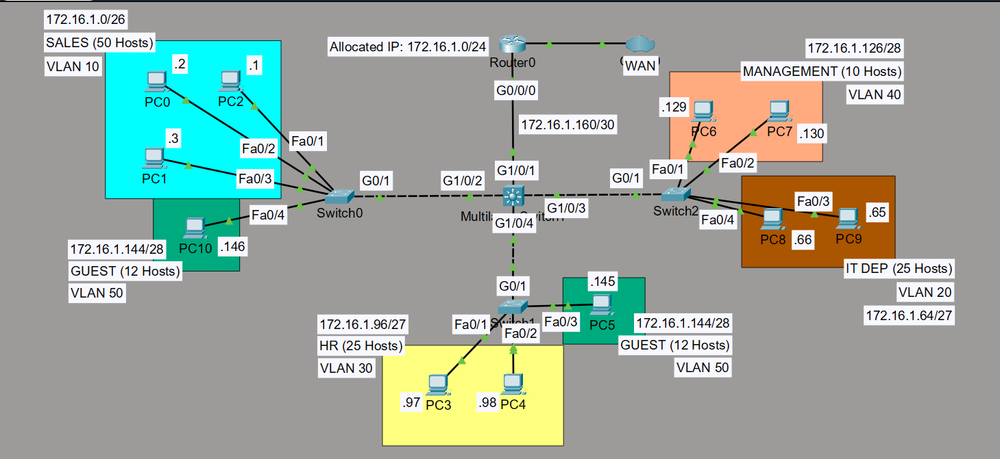

# Enterprise Multi-VLAN Campus Network & Inter-VLAN Routing

## Overview
Designed and implemented a 3-tier campus network in Cisco Packet Tracer featuring an Edge Router, a Core Layer 3 Switch performing Inter-VLAN routing, and 3 Access Switches segmenting 6 VLANs across departments.

## Topology Diagram

